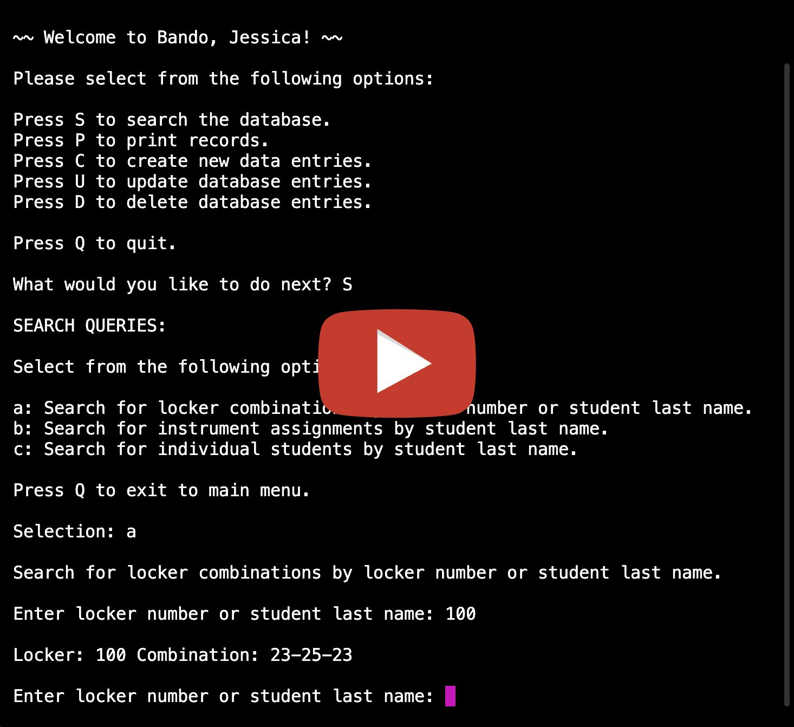

# BANDO - An Instrument Locker CLI

As a former music teacher, one of the biggest organizational challenges was keeping track of locker and instrument assignments for my band students. Some of the biggest issues included:

* Students constantly forgetting or misplacing their locker combinations
* Needing to get into a students' locker if they are absent to access their music
* Having to print a hard copy of the locker inventory and start fresh every year
* Tracking an instrument inventory separately from the locker inventory

BANDO is a Command Line Interface allowing users to query from a SQLAlchemy database of instruments, lockers, and students. The database is set up with many-to-many relationships backrefered through the student table. Students can have many instruments and students can have many lockers.

BANDO allows the user to complete full CRUD actions through the CLI. The main menu options include:

* Search the database
* Print records from the database
* Create new records
* Update existing records
* Delete records from the database

This CLI is set up specifically for HIGH SCHOOL BAND student data, but could be adapted for other grade levels or educational disciplines.

## Walkthrough

<a href="https://www.youtube.com/watch?v=jzYhgUnqOOo" title="Locker Inventory CLI Walkthrough"></a>

## Installation

Fork and clone a copy of the repository. This project requires python3 and pip to be installed on your computer. Install dependencies by running pipenv install, then start up a virtual environment by running pipenv shell.

### Seed Database

In order to seed the database, run the following commands:

```python
cd lib
cd db
python seed.py
```

### Run CLI

CD back to the lib folder, then run the following command:

```python
./bando.py
```

You can now access and interact with the data from the database through the CLI.

## Usage

### File Overview

The lib folder holds all of the CLI files as well as the db database folder.

Db folder:

Within the db folder, the models.py file holds the table models for the classes Instrument, Locker, and Student. There is also a folder of migrations which track the alembic upgrades and migrations made throughout the project. The seed.py file is set up to seed the band_lockers.db database with content generated by Faker. If you would like to use your own data, you can edit the seed.py file or create a new .py file at the same level with instances of your data. The debug.py file can be run to test instances of classes you'd like to add to the database.

Lib folder:

Within the lib folder, the bando.py file runs the CLI. This file contains imports from the subfunctions folder to help organize the CLI by CRUD function aligned with the CLI main menu options:

* Search the database = /function1.py
* Print records from the database = /function2.py
* Create new records = /function3.py
* Update existing records = /function4.py
* Delete records from the database = /function5.py

Subfunctions folder:

Each of the helper functions in the subfunctions folder import the necessary models and packages to query the database using SQLAlchemy. As a user makes selections in the CLI, each subfunction carries out the logic of their choice. 

## Resources

To learn more about querying using SQLAlchemy: [SQLAlchemy Documentation](https://www.sqlalchemy.org/)

Check out Faker for all of your database seeding needs: [Faker Documentation](https://faker.readthedocs.io/en/master/)

Do your tables look awful? Check out Pandas to learn how to pretty-print your data! [Pandas Documentation](https://pandas.pydata.org/)

Test out user input verification: [Regex101](https://regex101.com/)

Display selectable options in the terminal and return the selection ID (or whatever you want!) using Inquirer: [Inquirer Documentation](https://pypi.org/project/inquirer/)